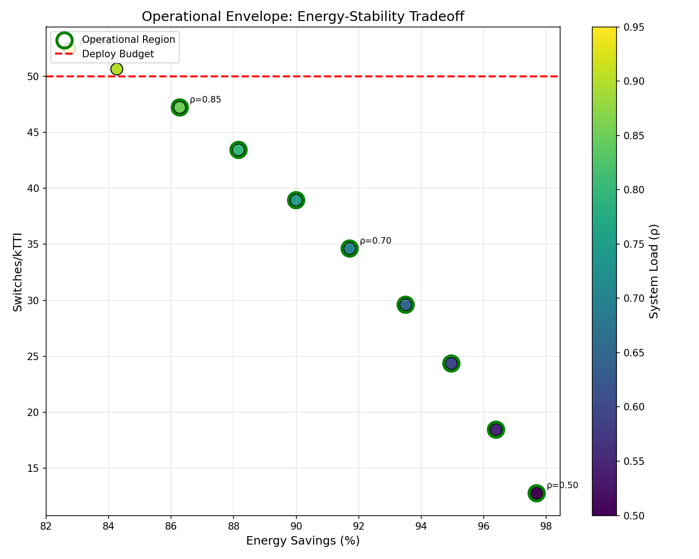
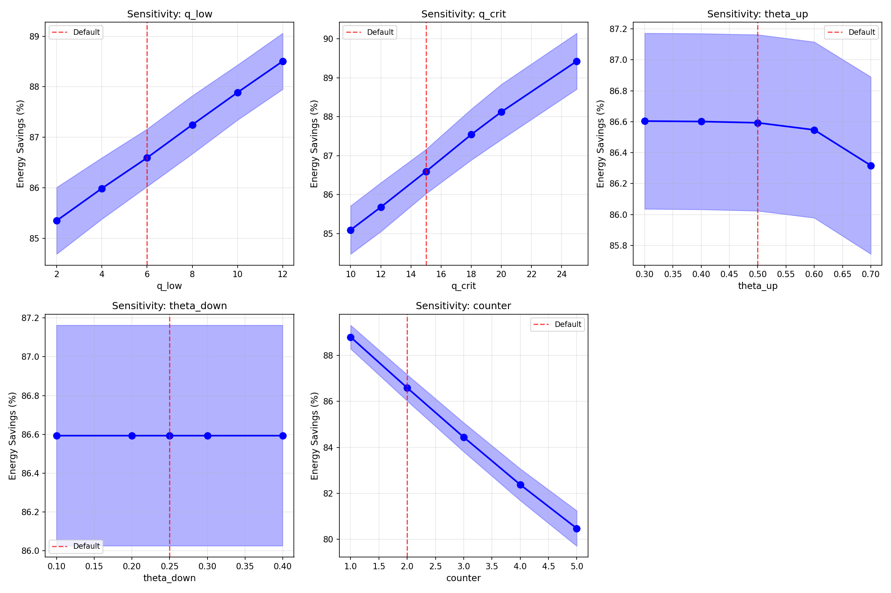
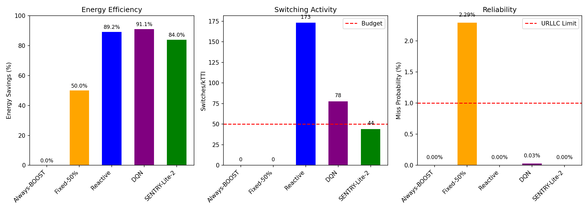

# SENTRY-Lite-2

**A Pareto-Optimal Dual-Mode Controller for Energy-Efficient URLLC Systems**

[](LICENSE)

## Overview

This repository contains the simulation code and experimental results for the paper:

> M. Supoh, "SENTRY-Lite-2: A Pareto-Optimal Dual-Mode Controller for Energy-Efficient URLLC Systems," *IEEE Transactions on Wireless Communications*, under review, 2025.

SENTRY-Lite-2 is a lightweight UE-side dual-mode controller that achieves significant energy savings while maintaining URLLC compliance through a queue-safe exit mechanism.

## Key Results (Reference Setting: ρ=0.85, D=0.5ms)

Reported in the paper for the single-UE reference configuration:

| Metric | Reported Value |
|--------|----------------|
| Energy Savings | ~84% |
| Miss Probability | <0.01% (URLLC compliant) |
| Switching Rate | ~44 sw/kTTI |
| Safety Margin | >10,000× below 1% threshold |

*Note: Results are stochastic; exact values may vary slightly across platforms and seeds.*

## Repository Structure

```
SENTRY-Lite-2/
├── src/
│   ├── controllers/
│   │   └── cqi_adaptive_sentry.py   # Controller implementation
│   ├── environment/
│   │   ├── urllc_env.py             # Base URLLC environment
│   │   └── wireless_env.py          # Wireless channel models
│   └── agents/
│       └── dqn_agent.py             # DQN baseline agent
├── experiments/
│   ├── paper_validation_v2.py       # Main validation script
│   ├── compare_controllers.py       # Table II experiments
│   ├── operational_envelope.py      # Operating envelope sweep
│   ├── sensitivity_analysis.py      # Parameter sensitivity
│   ├── statistical_bounds.py        # Clopper-Pearson CI
│   ├── multi_ue_experiment.py       # Multi-UE scenarios
│   └── results/                     # All outputs (CSV + figures)
│       ├── *.csv                    # Raw experimental data
│       ├── *.png                    # Figure images
│       └── *.pdf                    # Publication-quality figures
├── configs/
│   └── default_config.yaml          # Default parameters
├── requirements.txt
├── LICENSE
└── README.md
```

## Requirements

```
Python >= 3.8
numpy >= 1.21
pandas >= 1.3
scipy >= 1.7
matplotlib >= 3.4
PyYAML >= 6.0
```

## Installation

```bash
git clone https://github.com/mohammedsupoh/SENTRY-Lite-2.git
cd SENTRY-Lite-2
pip install -r requirements.txt
```

## Quick Start (Paper Reproduction)

### 1. Validate SENTRY-Lite-2 (Table II reference)

```bash
python experiments/paper_validation_v2.py
```

**Expected output:** Energy savings ~77-84%, P_miss <0.1%, Switches ~44-51 sw/kTTI

### 2. Run Controller Comparison (Table II)

```bash
python experiments/compare_controllers.py
```

### 3. Generate Operating Envelope (Fig. 5)

```bash
python experiments/operational_envelope.py
```

### 4. Run Sensitivity Analysis (Fig. 4)

```bash
python experiments/sensitivity_analysis.py
```

## Output Location

**All outputs are in `experiments/results/`:**

| Output Type | Files |
|-------------|-------|
| CSV data | `experiments/results/*.csv` |
| PNG figures | `experiments/results/*.png` |
| PDF figures | `experiments/results/*.pdf` |

### Pre-generated CSV Files

| File | Description |
|------|-------------|
| `controller_comparison.csv` | Table II baseline comparison |
| `sensitivity_analysis_full.csv` | Parameter sensitivity data |
| `operational_envelope_data.csv` | Load-deadline sweep results |
| `multi_ue_results.csv` | Multi-UE experiment data |
| `lyapunov_drift_analysis.csv` | Stability analysis |

### Pre-generated Figures

#### Fig. 3: Pareto Frontier (Energy-Stability Trade-off)


#### Fig. 4: Parameter Sensitivity Analysis


#### Fig. 5: Operational Envelope


#### Baseline Controller Comparison



## Controller Parameters (Table I in paper)

| Parameter | Value | Description |
|-----------|-------|-------------|
| `q_low` | 6 packets | Queue safety threshold |
| `q_crit` | 15 packets | Emergency trigger |
| `counter` | 2 TTIs | Consecutive confirmation |
| `θ_up` | 0.50 | Safe exit threshold |
| `θ_down` | 0.25 | Entry threshold |
| `emergency_duration` | 5 TTIs | Burst absorption |
| `cooldown` | 1 TTI | Anti-chattering |
| `EWMA α` | 0.20 | Smoothing factor |

## System Parameters (6G-aligned)

| Parameter | Value |
|-----------|-------|
| TTI duration | 0.125 ms |
| S_BASE | 4 packets/TTI |
| S_BOOST | 10 packets/TTI |
| Deadline D | 0.5 ms (default) |
| Load ρ | 0.85 (default) |

## Reproducibility Notes

- All experiments use **fixed random seeds** (seeds 0-19 for 20-seed runs)
- Results are stochastic; qualitative properties (URLLC compliance, deployability) are preserved
- Expected runtime: ~2-5 minutes per experiment on standard hardware
- All claims are bounded to the tested parameter ranges documented in configs

## Additional Documentation

For detailed methodology and robustness extensions, see:

| Document | Description |
|----------|-------------|
| [docs/README.md](docs/README.md) | Documentation index |
| [ROBUSTNESS_VALIDATION.md](ROBUSTNESS_VALIDATION.md) | Validation plan overview |
| [docs/methods/](docs/methods/) | Statistical methodology |
| [docs/robustness-extensions/](docs/robustness-extensions/) | Extension details |

## Citation

If you use this code, please cite:

```bibtex
@article{supoh2025sentry,
  author  = {M. Supoh},
  title   = {{SENTRY-Lite-2}: A {P}areto-Optimal Dual-Mode Controller 
             for Energy-Efficient {URLLC} Systems},
  journal = {IEEE Trans. Wireless Commun.},
  year    = {2025},
  note    = {under review}
}
```

## License

This project is licensed under the MIT License - see the [LICENSE](LICENSE) file for details.

## Contact

Mohammed Supoh - mohammed.supoh7@gmail.com

ORCID: [0009-0001-0381-9068](https://orcid.org/0009-0001-0381-9068)
